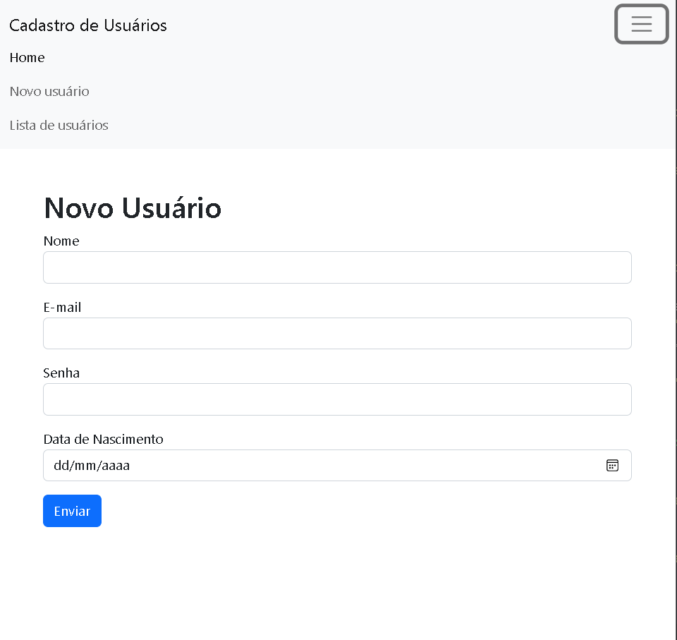
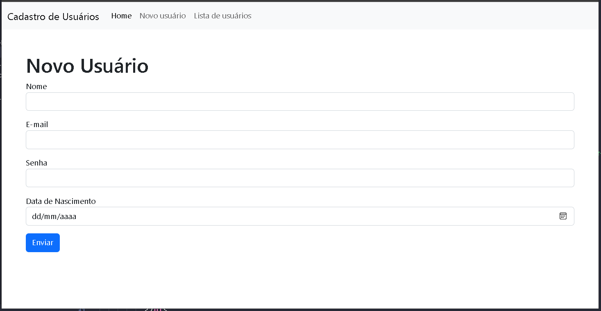
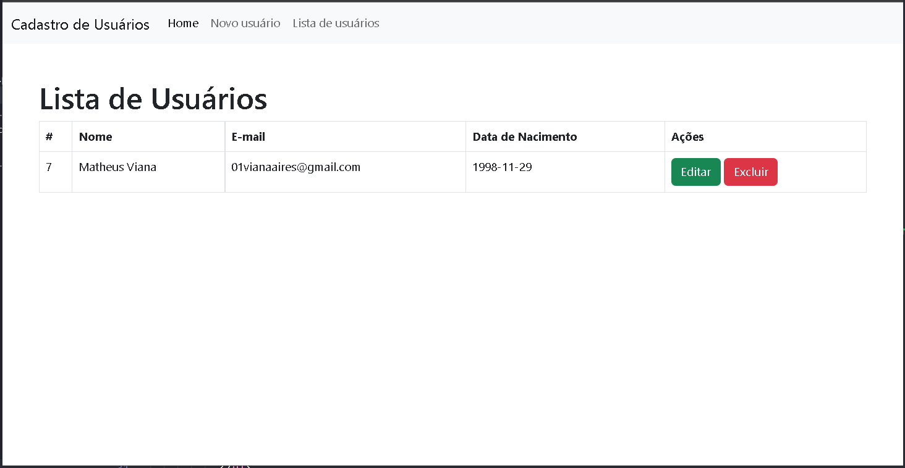

# Cadastro de usuários com CRUD PHP

Área de cadastro de usuários, podendo editar os dados e excluir informações de usuários já cadastrados.

Acesse o link abaixo para observar as funcionalidades:
https://youtu.be/29OHcwyqf18

## Tecnologias

- PHP
- BOOTSTRAP
- GIT e GITHUB

## Contato

01m.viana@gmail.com
